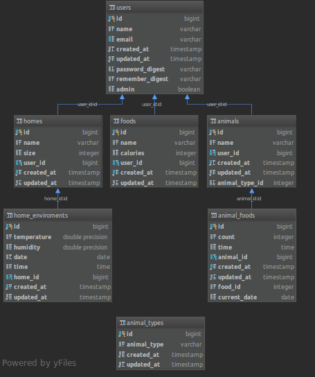

# DBS 2019
## Zadanie:
Vo vami zvolenom prostredí vytvorte databázovú aplikáciu, ktorá komplexne rieši päť vami zadefinovaných scenárov (prípadov použitia) vo vami zvolenej doméne tak, aby ste demonštrovali využitie relačnej databázy podľa pokynov uvedených nižšie. Presný rozsah a konkretizáciu scenárov si dohodnete s Vašim cvičiacim na cvičení. Projekt sa rieši vo dvojiciach, pričom sa očakáva, že na synchronizáciu práce so spolužiakom / spolužiačkou použijete git. 

## Petdiary
 je wbová aplikácia, ktorá slúži
chovateľom na zaznamenávanie si kalórií, ktoré ich 
domáci miláčik počas dňa prijal. Používateľ sa
zaregistruje. Vytvorí si živočícha a typ potravy, ktorou ho
kŕmi. Aplikácia zobrazuje používateľovi jednotlivé záznami,
ktoré sú vyzualizované grafmi. Zároveň si používateľ
môže zobraziť štatistiky, kde má vypočítaný priemerný počet kalórií na
jednotlivý tip živočícha za deň. Zároveň má možnosť vydieť priemerný
počet kalórií všetkých používateľov.

**Stručne opísané cenáre:**
+ **Prvý scenár**: Pridanie záznamu. Tento scenár sa v 
mojej aplikácií nachádza niekoľko krát. napr. Vytvorenie používateľa,
vytvorenie potravy, ktorou chce používateľ daného živočícha kŕmiť,
vytvorenie živočícha, vytvorenie záznamu pre živočícha.

+ **Druhý scenár**: Zobrazenie záznamu. Tento scenár sa takisto
vyskytuje veľa krát. Používateľ má možnosť zobraziť všetkých používateľov,
živočíchy aj záznami.

+ **Tretí scenár**: Vymazanie záznamu. Používateľ má možnosť vymazať
záznam o živočíchovy. Takisto môže vymazať aj živočícha. Vymazanie živočícha je
ošetrené transakciou, ktorá vymaže aj všetky záznami o ňom.

+ **Štvrtý scenár**: Updatnutie záznamu. Používateľ má možnosť updatnúť svoj profil(môže si v ňom zmeniť údaje).

+ **Piaty scenár**: Vyhľadanie záznamu. Používateľ má možnosť vyhľadať živočíchy.
Vyhľadávanie prebieha na základe mena alebo typu živočícha.

Projekt je naprogramovaný v programovacom jazyku Ruby on rails. 
V projekte sú využité programovacie jazyky: HTML, CSS, JavaScript, Ruby

Použitá databáza: Postgresql

Prístup k databáze je vyriešený v database.yml 

## Využitie relačnej databázy:
+ Join, group by, agregačná funkcia - sa nachádzajú hlavne v statisctics_controller.rb, ale je možné nájsť
ich aj v ostatných controlleroch.V agregačných funkciách využívam COUNT, AVG, SUM. Pri práci s databázou som na písanie 
príkazov použil jazyk SQL a Ruby.
+ Transakcia - väčšinu transakcií si ruby on rails rieši sám, pomocou active recordu,
ale transakcia, ktorú som napísal ja a využíva prácu s viacerými tabuľkami sa nachádza v
animals_controller.rb. Rieši vymazanie z dvoch tabuliek(animals, animal_foods). Najprv sa 
vymažú všetky záznami a potom sa vymaže aj živočích.

Príkazy, ktoré som zadal na vygenerovanie dát do databázy sa nachádzajú v
[dbs_generate_data.sql](dbs_generate_data.sql)

Schéma databázy:


Tabuľky a stĺpce v databáze:


## Obrazovky a časti kódu

Obrazovka pre vytvorenie živočícha a potravi:


Obrazovka pre vytvorenie živočícha a potravi.

Kód pre vytvorenie živočícha:
```ruby
  def create
    @animal = current_user.animals.build(animal_params)
    if @animal.save
      flash[:success] = 'Animal created'
      redirect_to root_url
    else
      flash.now[:error] = "Could not create animal"
      render 'animals/animal_form'
    end
  end
```
Obrazovka s už vytvorenými živočíchmi:


Po kliknutí na gravatara alebo meno zvieraťa sa zobrazí detail.
Používateľ si v tomto okne môže viesť záznam o tom, čím živočícha kŕmil, a koľko jeho živočích prijal kalórií

Pred pridaním záznamu:

Ukážka po pridaní záznamu:


Zmysluplné použitie transakcie:
```ruby
 def destroy
    notes_count = Food.count_by_sql("SELECT COUNT(*) FROM animal_foods f WHERE f.animal_id = #{@animal.id}")
    if notes_count != 0
      ActiveRecord::Base.connection.execute(
        "BEGIN;
        DELETE FROM animal_foods WHERE animal_foods.animal_id = '#{@animal.id}';
        DELETE FROM animals WHERE animals.id = '#{@animal.id}';
      COMMIT;"
    )
    else
      ActiveRecord::Base.connection.execute(
          "BEGIN;
        DELETE FROM animals WHERE animals.id = '#{@animal.id}';
      COMMIT;"
      )
    end
    flash[:success] = "Animal was deleted"
    redirect_to request.referrer || root_url
  end
```

Update používateľa:
```ruby
  def update
    @user = User.find(params[:id])
    if @user.update_attributes(user_params)
      flash[:success] = "Profile updated"
      redirect_to @user
    else
      render 'edit'
    end
  end
```
Okno pre update používateľa:


Select pre vyhľadávanie podľa mena alebo typu zvieraťa
```ruby
  def index
    if params[:search]
      @animals= Animal.joins(:animal_type).where("animals.name like ? or animal_types.animal_type like ?", "%#{params[:search]}%","%#{params[:search]}%").paginate(page: params[:page],per_page: 8)
    else
      @animals= Animal.all.order('created_at DESC').paginate(page: params[:page],per_page: 8)
    end
  end
```
Okno pre vyhľadanie používateľa:


Zároveň som aj doplnil aby sa pri živočíchovy zobrazilo číslo s počtom záznamov, ktoré su o ňom vedené.


Využitie joinov, agregačných funkcií a group by pri výpise štatistík 
```ruby
  def show
    @days = AnimalFood.where('animal_foods.current_date = ?', Date.today).sum(:count)
    @animal_calories = ActiveRecord::Base.connection.exec_query(
        "SELECT round(AVG(f.calories * af.count),2), at.animal_type FROM animal_foods af
        JOIN foods f on f.id = af.food_id
        JOIN animals a ON a.id = af.animal_id
        JOIN animal_types at ON at.id = a.animal_type_id
        GROUP BY  at.id")
  @my_animal_calories = ActiveRecord::Base.connection.exec_query(
      "SELECT round(AVG(f.calories * af.count),2), at.animal_type FROM animal_foods af
        JOIN foods f on f.id = af.food_id
        JOIN animals a ON a.id = af.animal_id
        JOIN animal_types at ON at.id = a.animal_type_id
        JOIN users u ON u.id = a.user_id
        WHERE u.id = #{current_user.id}
        GROUP BY  at.id")
  end
```

Okno pre zobrazenie štatistík:


### Tabuľky so vzťahom one to many


animals =>   animal_foods 

Zviera môže mať veľa záznamov o podanej potrave

---

users => foods

User môže mať vytvorených veľa druhov potravi

---

users => animals

User môže mať veľa zvierat

---

users => homes

User môže mať veľa terárií

---


homes => home_enviroment

Terárium môže mať veľa záznamov o prostredí

---

Číselník:
animal types

---

#### Tabuľka ***animals***: 
slúži na evidenciu zvierat

##### Atribúty v tejto tabuľke:

name = meno zvieraťa

user_id = id usera ktorí vlastní zviera

animal_type_id = typ zvieraťa - odkazuje na tabuľku animal_types

---

#### Tabuľka ***users***:
slúži na evidenciu používateľov

##### Atribúty v tejto tabuľke:


name = meno používateľa

email = email používateľa

password_diggest = heslo používateľa

remember_digest = zapametanie hesla

admin = hovorí či je daný používateľ admin, admin môže vymazávať ostatných používateľov

---

#### Tabuľka ***foods***:
slúži na evidenciu potravy pre živočíchy. Potrava sa viaže na usera.

##### Atribúty v tejto tabuľke:

name = názov potravy

calories = počet kalórii danej potravy

user_id = id používateľa, ktorému potrava patrí

---

#### Tabuľka ***animal_foods***:
tabuľka na evidenciu záznamov o potrave pre daného živočícha

##### Atribúty v tejto tabuľke:

count = počet potravy (v ks)

time = čas podávania potravy

animal_id = id zvieraťa, ktorému záznam patrí

food_id = id potravy, ktorá bola zvieraťu podaná

current_date = deň kedy bola zvieraťu potrava podaná

---

#### Tabuľka ***homes***:
Slúži na evidenciu terárií (táto tabuľka bola vytvorená hlavne kôli požiadavke 7 tabuliek na DBS. Na vos ju podľa všetkého zruším)

##### Atribúty v tejto tabuľke:

name = názov terária

size = veľkosť terátria

user_id = id používateľa, ktorému terárium patrí

---

#### Tabuľka ***home_enviroments***:
Slúži na evidenciu teploty a vlhkosti v teráriu (na vos bude asi tiež zrušená)

##### Atribúty v tejto tabuľke:

temperature = teplota v akváriu

humidity = vlhkosť v teráriu

date = dátum kedy bol záznam vytvorený

time = čas kedy bol záznam vytvorený

home_id = id terária ktorému záznam patrí

---

#### Tabuľka ***animal_types***:
Slúži ako číselník pre tabuľku animals, druhy zvierat boli vygenerované v seeds.rb

##### Atribúty v tejto tabuľke:

animal_type = názov druhu zvieraťa 
  
---

### Ostatné informácie: 
 

* Ruby version: 2.6.0

Úpravy databázy som robil pomocou migrácií.

Modeli som vygeneroval pomocou railsov zadaním príkazu:
rails g model názov a čo má obsahovať

Controlleri som vygeneroval pomocou:
rails g controller názov

### Zhodnotenie:

Môj projekt podľa mna obsahuje všetko, čo bolo opísané v požiadavkách.
Bolo vytvorených 5 funkčných scenárov. Projekt obsahuje agregačné funkcie, group by, join, transakciu.
V projekte je zahrnutý insert, update, delete, zobrazenie detailu, search.
Pre zrýchlenie vyhľadávania som použil indexy. V tabuľke animal_foods mam 15 miliónov záznamov.
V ostatných mám vyše milióna. Počet tabuliek v projekte 7. Tabuľky sú opísané vyššie. 


Autor: Michal Kabáč, asi id 92784